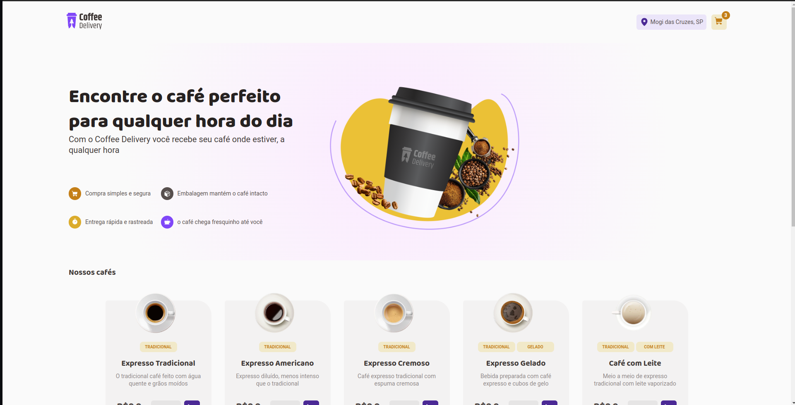
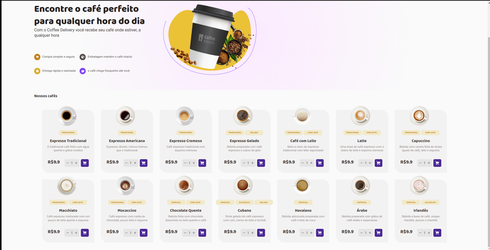
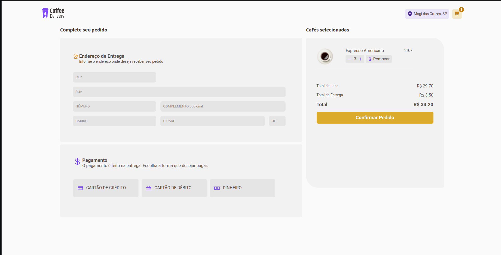
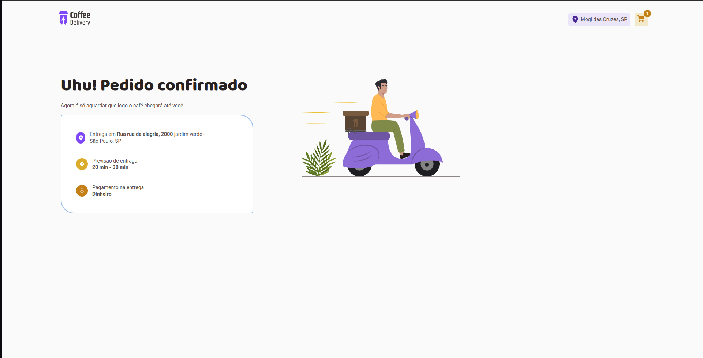

# Coffee Delivery - Aplicação Front-End

Este projeto faz parte da trilha de aprendizado React Ignite, da escola [Rocketseat](https://www.rocketseat.com.br/). 
Por tanto o layout dessa aplicação foi totalmente desenvolvido por eles.


<h1> 
    
    <div > 
        
        
    </div>
    
</h1>

## :computer: Requesitos

Você deve ter o Node.js e o NPM instalados.

## :cd: Instalando

```bash
git clone https://github.com/Caduaaraujoo/Coffee-Delivery.git

cd Coffee-Delivery
```

```bash
npm install || yarn add
```

##  :runner: Rodando a aplicação

```bash
npm run dev || yarn run dev
```
**OBS**: é necessário rodar o mock, para as informações dos produtos sejam carregadas. Por isso abra mais uma aba do terminal e digite:

```bash
npm run mock || yarn run mock
```

## :rocket: Tecnologias

* **React**
* **Styled-Components**
* **Typescript**
* **ContextApi**
* **React-Router-Dom**
* **Json-Server**

## :coffee: Sobre a aplicação

Coffee Develivery é um aplicação front-end, com a intenção de reforçar os meus estudos e me desafiar cada vez mais.

Ela possui uma página de seleção de cafés, onde o usuário pode selecionar a quantidade desejada e adicionar ao carrinho.

Indo para a página de carrinho o usuário pode diminuir, aumentar ou até excluir o café. 

Para finalizar a compra é necessário preencher os campos obrigatórios, caso o usuário tente finalizar sem preencher todos os campos obrigatórios, será informado quais campos devem estarem preenchidos.

Se tudo der certo, seu café em breve chegará :smile:
